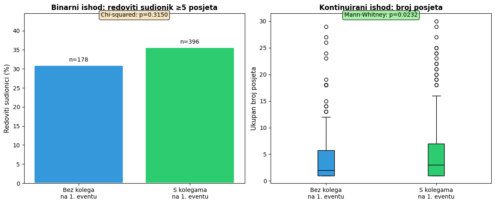
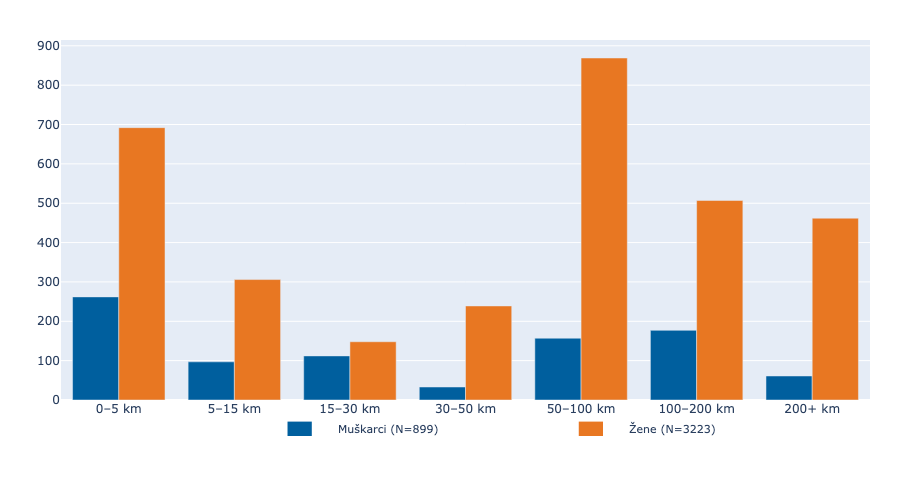
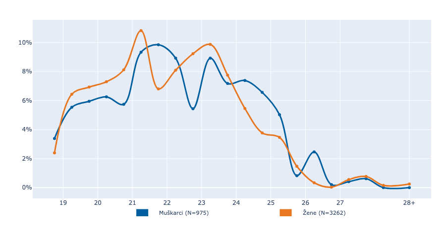
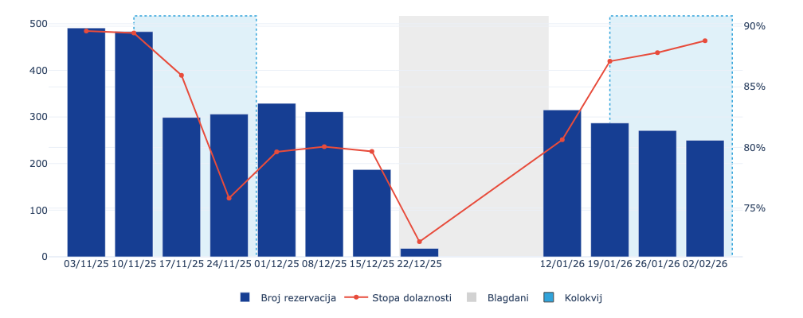
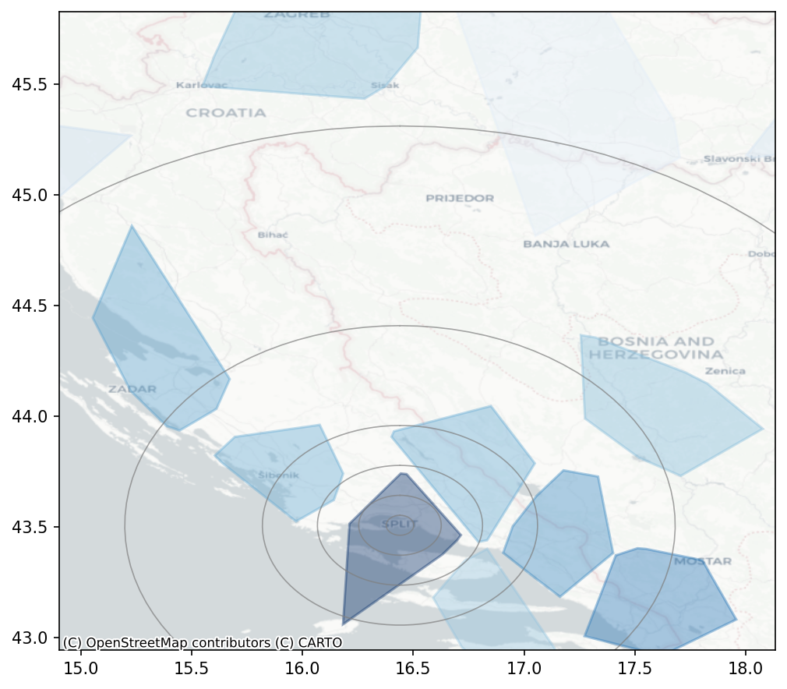
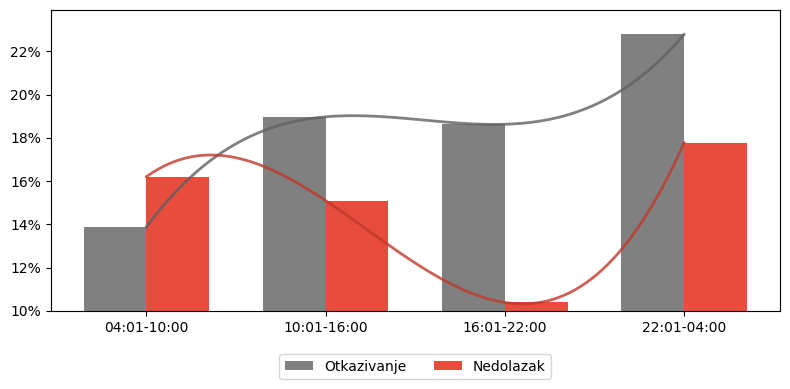
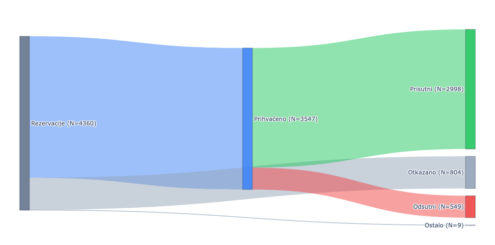
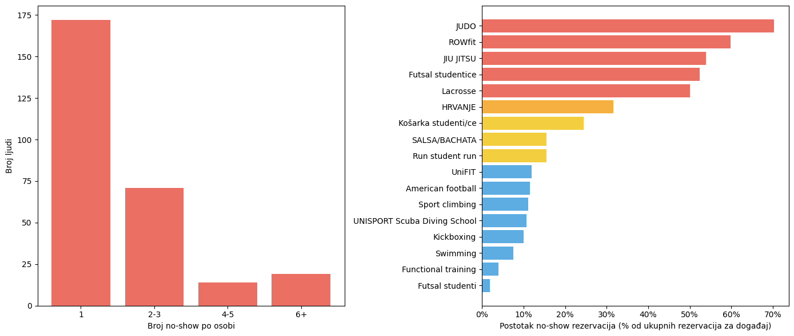
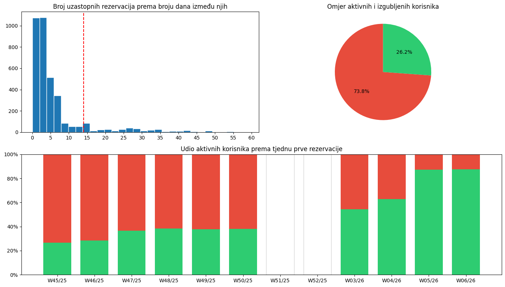

# Unisport Split: Data-Driven Recreation Insights

UniSport Split and Unispot introduced a dynamic booking system for the UniSport Health Recreation program, replacing the once-a-year sign-up form. This shift improved flexibility and occupancy, and created a **new stream of measurable behavioral data** for analysis.

The first (harder!) part of the work is **hypothesis-driven**: it tests whether early social activation and a critical participation threshold shape long-term engagement, and whether the mechanisms compound or substitute one another.

The second (simpler!) part is **operational analytics**: it builds data pipelines (people, events, reservations, geocoding, gender inference), defines retention and churn rules, and analyzes drop-off, repeat participation, cancellations, and no-shows across groups, contexts, and time.

> This is a hobby project turned into a university assignment — the (vibe)code is written experimentally.

## Overview

### Hypothesis

#### Does social activation drive sport habit formation? ([full analysis](notebooks/social-activation.ipynb))

It is not a significant predictor of the binary outcome, but is significant for the continuous outcome. Users who attended the first event with colleagues have on average more visits, but do not achieve a significantly higher rate of crossing the regular-participation threshold.

Given the literature, **group onboarding by faculty** (shared first experiences) remains a sensible guideline for programs, though the evidence in this sample is limited to effects on visit count rather than on the binary engagement threshold.

#### Is there an activation barrier (a critical threshold) for sport habit formation? ([full analysis](notebooks/social-activation.ipynb))

> tba

#### Behavior-change design: hierarchy or synergy? ([full analysis](notebooks/social-activation.ipynb))

> tba

### Segmentation

#### Distance is a barrier ([source code](/notebooks/distance-is-a-barrier.ipynb))

Students living 5 to 50 kilometers away from the event make the fewest reservations. Future research should determine whether this pattern is global or specific to academic sports. If not sports-specific, integration in other domains (e.g., dining, work) becomes the focus.

#### Who enters first, who leaves last? ([source code](/notebooks/distance-is-a-barrier.ipynb))

Women start engaging in recreation earlier than men but also leave the system earlier. Men activate later and consequently exit later. Men quit faster and remain in the system for a shorter period than women.

### Three random perspectives

#### Attendance correlation ([source code](/notebooks/attendance-correlation.ipynb))

The reservation dataset is difficult to analyze due to three planned "interruptions" (holidays and exams). Recent data show a trend: attendance rates are higher despite fewer reservations. Correlation analysis is planned in a few weeks. Extensive analysis could cover general student activity during these periods (e.g., dining, work,..).

#### Geographic clusters ([source code](/notebooks/geographic-clusters.ipynb))

Clusters emerge as participant "sources"; color encodes logarithmic participant count per cluster. We currently lack general university geographic structure, a useful coefficient for interpreting which areas are truly more sport-active. Radius distances from Split are shown for the distance–participation section below.

#### Late-night impulse bookings ([source code](/notebooks/attendance-correlation.ipynb))

If we visualized reservation outcomes by creation time (excluding confirmed bookings), late-night reservations would show 2% more no-shows and up to 5% more cancellations, while morning bookings would have the lowest cancellation rates.

### [INTERNAL] Operational insights

#### Reservation distribution

The distribution of reservation status is constant over time, and no difference by gender was observed.

#### No-shows ([source code](/notebooks/no-show.ipynb))

Some individuals have an extreme number of no-show reservations. The same applies to certain sports. There are three possible explanations: negligent participants, negligent trainers, or both.

#### Churn ([source code](/notebooks/churn-window.ipynb))

If a reservation is not made within two weeks, the user has probably quit. Users who have not attended in the last 2 weeks comprise 73.8% of the user base. Only one in four users who started in the first week is still active. Something seems off.

